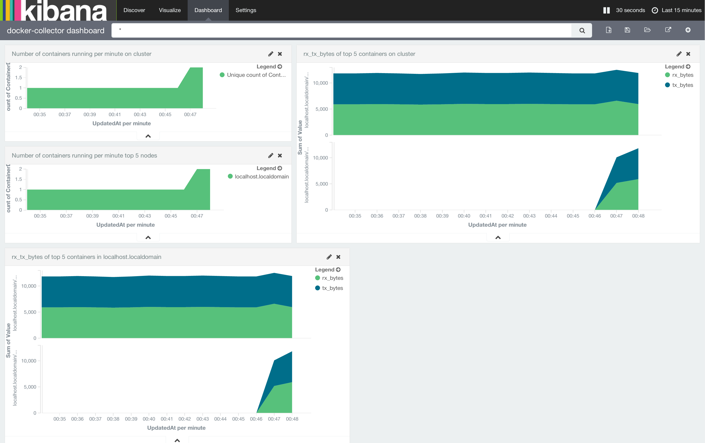

# Statistics collector for Docker containers

## Introduction

`docker-collector` is a daemon which collects statistics and events of Docker
containers in a cluster and stores the data in a distributed storage such
as Elastic to make it available for analytics.

Currently supported statistics include:
  - Cluster node lifecycle (star/stop time,
  - Container lifecycle (start/stop time, ID, PID, node, ...)
  - Network interface statistics (bytes, packets, errors, ...)

It is trivial to add support for additional statistics and events. A set
of Kibana templates is provided to visualize the gathered statistics of
an entire cluster.

## TOC

  * [Quick Howto](#quick-howto)
  * [Requirements for Developers](#requirements-for-developers)
  * [Using docker-collector](#using-docker-collector)
    * [Start ElasticSearch](#start-elasticsearch)
    * [Start docker-collector](#start-docker-collector)
      * [Usage: docker-collector options](#usage-docker-collector-options)
    * [Kibana](#kibana)
  * [F.A.Q.](#faq)
    * [What OS do you support?](#what-os-do-you-support)
  * [License](#license)

## Quick Howto

To get started, you can bring up the necessary components of a node using
the provided Docker compose file:

```bash
$ git clone https://github.com/cilium-team/docker-collector.git
$ cd docker-collector
$ docker-compose up
```

Open you browser and point it to the [Kibana Dashboard]
(http://localhost:5601/#/dashboard/docker-collector-dashboard?_g=(refreshInterval:(display:'30%20seconds',pause:!f,section:1,value:30000),time:(from:now-15m,mode:quick,to:now))&_a=(filters:!(),panels:!((col:1,id:Number-of-containers-running-per-hour-on-cluster,row:1,size_x:5,size_y:2,type:visualization),(col:1,id:Number-of-containers-running-per-minute-top-5-nodes,row:3,size_x:5,size_y:2,type:visualization),(col:6,id:rx_tx_bytes-of-top-5-containers-on-cluster,row:1,size_x:7,size_y:4,type:visualization),(col:1,id:rx_tx_bytes-of-top-5-containers-in-localhost.localdomain,row:5,size_x:6,size_y:4,type:visualization)),query:(query_string:(analyze_wildcard:!t,query:'*')),title:'docker-collector%20dashboard'))
and you will see something similar to the following image.

 

Now you can see all the other containers except the ones containing
`docker-collector` in their name (see `-f` option used in docker-collector).

If you don't see any container statistics in the kibana's dashboard you may
not have started a non-management container yet. Start one, for example and
the data will appear in approximately 2 minutes after the default interval
used to read and store statistics.

```
docker run --rm -ti ubuntu ping www.google.com
```

## Requirements for Developers

- Go >= 1.4.2
- [Godep](https://github.com/tools/godep)

## Using docker-collector

### Start ElasticSearch

Run your local ElasticSearch instance using docker. In practice, this
needs to be slightly extended to configure Elastic cluster discovery.

```bash
docker run -d --name docker-collector-elasticsearch -p 9200:9200 -p 9300:9300 \
	elasticsearch:2.1.0 elasticsearch
```

### Start Logstash

Run your local Logstash instance using docker.

```bash
docker run -d --name docker-collector-logstash -p LOGSTASH_PORT:8080 \
    -v $PWD/configs/logstash.conf:/logstash.conf \
    logstash:2.1.0 logstash -f /logstash.conf
```

### Start docker-collector

You can run `docker-collector` as a Docker container like this:

```
docker run -d --name docker-collector --privileged -h "$(hostname)" \
        --pid host -e ELASTIC_IP=ELASTIC_SEARCH_IP \
        -e LOGSTASH_IP=LOGSTASH_IP -e LOGSTASH_PORT=LOGSTASH_PORT \
        -v /var/run/docker.sock:/var/run/docker.sock \
        cilium/docker-collector -f 'docker-collector.*'
```

  * `-d` - Detached mode: run the container in the background.
  * `--pid` - host: use the host's PID namespace. Needed in order to
    see and access statistics of all local containers via /proc and
    /sys.
  * `--privileged` - Privileged mode: Needed in order to grant privileges
    to access stats of other containers.
  * `-h` - Container hostname: Set to the hostname of the local node.
  * `-e ELASTIC_IP=ELASTIC_SEARCH_IP` - Environment variable used to
    communicate with the ElasticSearch. Since we are exposing the port
    9200 (port used to transmit data) `docker-collector` will communicate
    to the given IP address, usually a local one is enough. (Note:
    It can't be 127.0.0.1 but it can be the IP given by docker, for example:
    172.17.0.11)
  * `-e LOGSTASH_IP=LOGSTASH_IP` - Environment variable used to communicate
    with the Logstash. You may also use links instead of specifying an IP
    address. Running it like `--link docker-collector-logstash:logstash`.
  * `-v /var/run/docker.sock:/var/run/docker.sock` - Used to find which
    containers are running in the local host.

#### Usage: docker-collector options

  * `-t SECONDS` - Interval in seconds how often to retrieve statistics from
    local containers (default: 60 seconds).
  * `-f string` - Regular expression to prevent docker-collector from
    collecting statistics and events of containers matching a particular
    name. Typically Used to exclude management containers.
  * `-c string` - Directory path for kibana configuration and templates.
    Configuration filename: 'configs.json', template filename:
    'templates.json' (default "/docker-collector/configs")
    (You can use docker `-v` option such as
    `-v ./myconfigs-directory-path:/docker-collector/configs` to use your
    own configuration files)
  * `-d string` - Set database driver to store statistics.
    * Valid options are:
      * elasticsearch (default)
  * `-i string` - Use a specific the prefix of the index name for
    elasticsearch. Suffix is -YYYY-MM-DD (default "docker-collector")
  * `-l string` - Set log level, valid options are
    (debug|info|warning|error|fatal|panic) (default "info")

### Kibana

Kibana is an open source data visualization plugin for Elasticsearch. It
provides visualization capabilities on top of the content indexed on an
Elasticsearch cluster.

Example of running a local kibana instance:

```
docker run -d --name docker-collector-kibana -p 5601:5601 \
    -e ELASTICSEARCH_URL=http://ELASTIC_SEARCH_IP:9200 \
    kibana:4.1.1
```

Open you browser and point it to the [Kibana Dashboard]
(http://localhost:5601/#/dashboard/docker-collector-dashboard?_g=(refreshInterval:(display:'30%20seconds',pause:!f,section:1,value:30000),time:(from:now-15m,mode:quick,to:now))&_a=(filters:!(),panels:!((col:1,id:Number-of-containers-running-per-hour-on-cluster,row:1,size_x:5,size_y:2,type:visualization),(col:1,id:Number-of-containers-running-per-minute-top-5-nodes,row:3,size_x:5,size_y:2,type:visualization),(col:6,id:rx_tx_bytes-of-top-5-containers-on-cluster,row:1,size_x:7,size_y:4,type:visualization),(col:1,id:rx_tx_bytes-of-top-5-containers-in-localhost.localdomain,row:5,size_x:6,size_y:4,type:visualization)),query:(query_string:(analyze_wildcard:!t,query:'*')),title:'docker-collector%20dashboard'))
(assuming running locally on the port as configured in the above example) and you will
see something similar to the following image.

 

Now you can see all the other containers except the ones starting with
`docker-collector` in their name (see `-f` option used in docker-collector).

If you don't see any container statistics in the kibana's dashboard you may
not have started a non-management container yet. Start one, for example and
the data will appear in approximately 2 minutes after the default interval
used to read and store statistics.

```
docker run --rm -ti ubuntu ping www.google.com
```

## F.A.Q.

### What OS do you support?

Although we have made a docker image the `docker-collector` binary inside
that image is only Linux/x86_64 ready.

## License

Licensed under the Apache License, Version 2.0 (the "License"); you may not
use this file except in compliance with the License.  You may obtain a copy
of the License at

   http://www.apache.org/licenses/LICENSE-2.0

Unless required by applicable law or agreed to in writing, software
distributed under the License is distributed on an "AS IS" BASIS, WITHOUT
WARRANTIES OR CONDITIONS OF ANY KIND, either express or implied.  See the
License for the specific language governing permissions and limitations
under the License.

